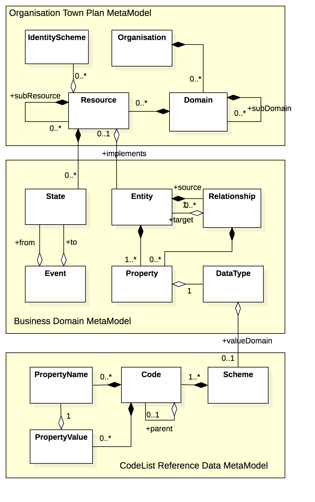
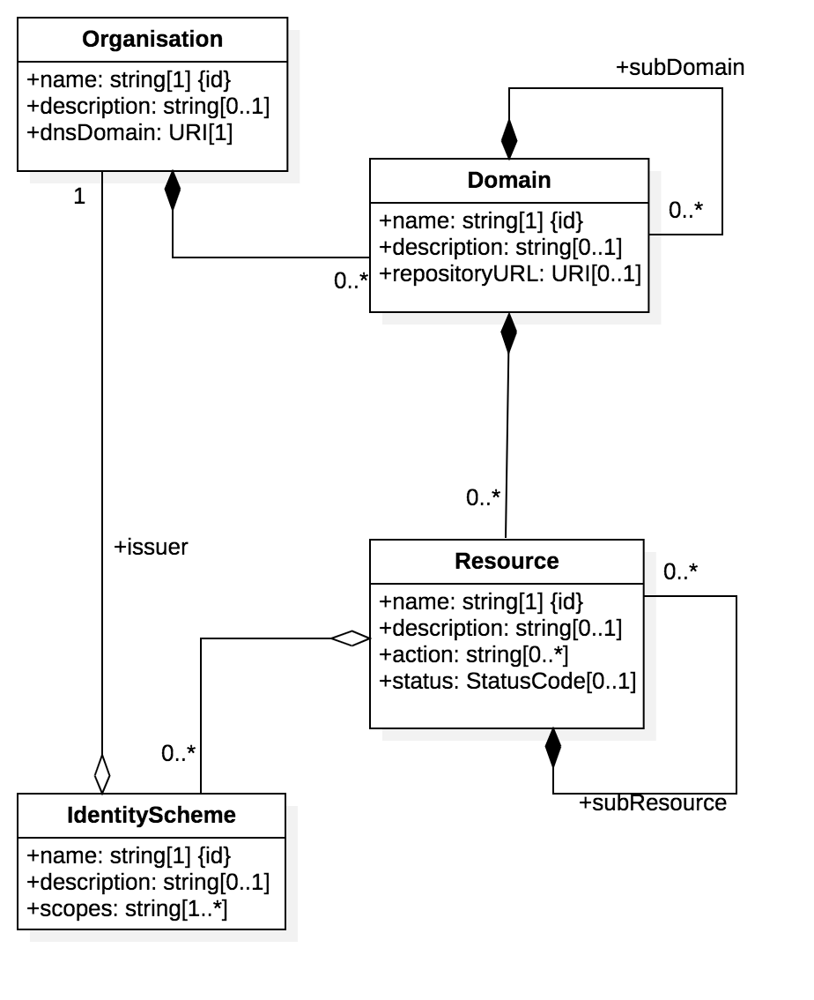
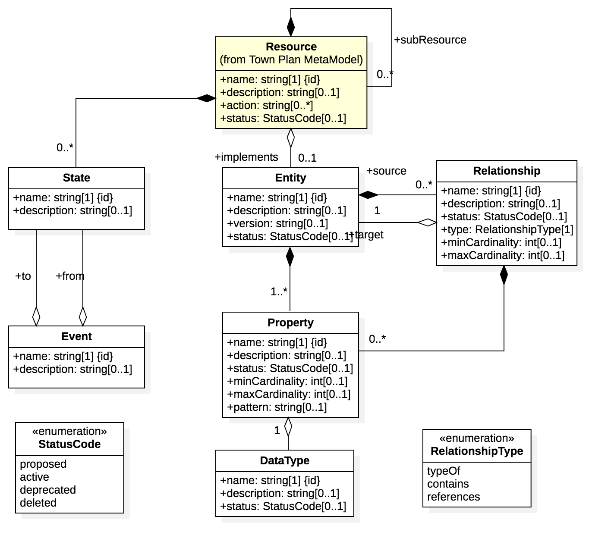

## Status

## Licence

All material published on edi3.org including all parts of this specification are the intellectual property of the UN as per the [UN/CEFACT IPR Policy](https://www.unece.org/fileadmin/DAM/cefact/cf_plenary/plenary12/ECE_TRADE_C_CEFACT_2010_20_Rev2E_UpdatedIPRpolicy.pdf).

This Specification is free software; you can redistribute it and/or modify it under the terms of the GNU General Public License as published by the Free Software Foundation; either version 3 of the License, or (at your option) any later version. See http://www.gnu.org/licenses.
 
## Change Process

This document is governed by the [2/COSS](http://rfc.unprotocols.org/spec:2/COSS/) (COSS).

## Language

The key words "MUST", "MUST NOT", "REQUIRED", "SHALL", "SHALL NOT", "SHOULD", "SHOULD NOT", "RECOMMENDED", "MAY", and "OPTIONAL" 
in this document are to be interpreted as described in RFC 2119.

# Introduction

This specification provides a standard JSON structure/schema for the representation of semantic library content and API models. This is used to

* import library content into any conformant modelling tool, and to
* interchange API models between conformant modelling tools.

This specification will have achieved its purpose when at least two different modelling tools (UML based or otherwise) can successfully interchange any of the three model types.

# Metamodel Overview

A DSL (domain specific language) approach is preferred here because it will be simpler and more stable than XMI (interchange standard for UML tools) and will allow non-UML based tools to participate equally in the market.

The interchange specification is broken into three parts, each with a dedicated metamodel and each representing models that can be interchanged independently.

* The  town plan model provides the top level organising framework for all UN/CEFACT API resources. There will typically be just one town plan file version current at any givent time.
* The resource model details the state lifecycle and information model of a specific API resource.  There will be typically be one file per domain or subdomain.
* the CodeList model represents code list schemes and the flat or hierarchical set of code values.  There will typically be one file per code list.

# Town Plan Model Specification

## Logical Model

to-do : define each entity.

## JSON Schema

[town plan schema](townplan-schema.json)

## Sample

coming soon

# Domain Model Interchange Specification

## Logical Model

to-do : define each entity.

## JSON Schema

[domain schema](domain-schema.json)

## Sample

coming soon

# CodeList Interchange Specification

## Logical Model

to-do : define each entity.

## JSON Schema

[codes schema](codes-schema.json)

## Sample

coming soon

